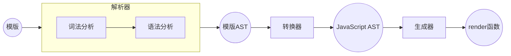
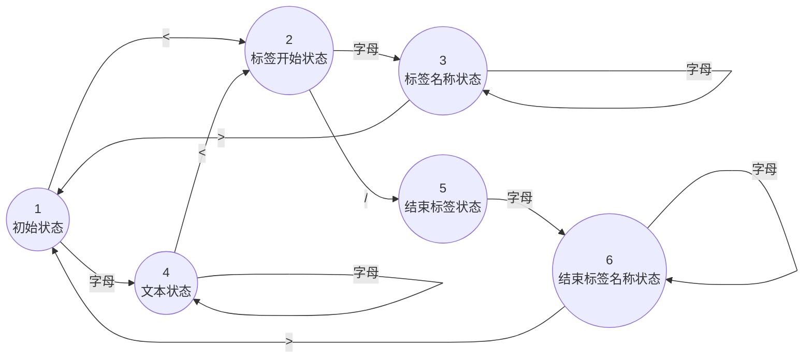

# Vue3原理解析-编译器核心技术概览

# 概览
#### 本文的目的是介绍`Vue.js 3`的`模板编译`的核心原理。
#### 文章将先介绍`模板编译`的流程及其各个步骤的作用，随后结合代码对每个步骤进行详细说明，代码主要引用自《Vue.js 设计与实现》。
#### 通过本文，读者将理解 `Vue.js` 中 `模板代码` 编译成 `js代码` 的核心原理。

# 背景
`Vue.js`的`模板语法`能够让开发者声明式地描述`视图`和`数据`间的关系，从而提升开发效率和代码直观性。在`Vue模板`变为`真实dom节点`的过程中，会有这些转变：`Vue模板` -> `render函数` -> `虚拟DOM` -> `真实DOM`。

将`Vue模板`变为`js代码`（即`render函数`的代码），就是`Vue模板编译器`要做的事情。

例如这段 **vue模板**：
```jsx
<div>
    <p>Vue</p>
    <p>Template</p>
</div>
```

经过编译后对应的`render函数`代码是：
 ```
function render () {
   return h('div', [h('p', 'Vue'), h('p', 'Template')])
}
```

# Vue.js 模版编译器的工作流程
## 整体流程

下图展示了模版编译器的工作流程：


由图所示，**模版编译器** 由以下三个部分组成：
1. **解析器（ parser ）**：将`模板字符串` 转 `模板AST`，**解析器**由两个部分组成：
    *  **词法分析**：将 `模板字符串` 转 `词法单元（tokens）`
    *  **语法分析**：将 **词法分析** 得到的 `词法单元（tokens）`构造成 `模板AST`
2. **转换器（ transformer ）**：将`模板AST` 转 `JavaScript AST`
3. **生成器（ generator ）**：将`JavaScript AST` 转 `JS代码`，在这里是`render函数`的`js代码`

PS：网站 [AST Explorer](https://astexplorer.net/) 可以在线把玩`AST（抽象语法树）`


## 举例说明
**下面通过举例，来说明 模版编译器 每一步做的事情。**

还是上面 **vue模板** 的例子：
```jsx
<div>
    <p>Vue</p>
    <p>Template</p>
</div>
```

### 词法分析
**模板** 经过 **词法分析** 分析后得到 **词法单元（`tokens`）**。
```js
[
    // 开始标签：<div>
    { type: 'tag', name: 'div' },
    // 开始标签：<p>
    { type: 'tag', name: 'p' },
    // 文本内容：'Vue'
    { type: 'text', content: 'Vue' },
    // 结束标签：</p>
    { type: 'tagEnd', name: 'p' },
    // 开始标签：<p>
    { type: 'tag', name: 'p' },
    // 文本内容：'Template'
    { type: 'text', content: 'Template' },
    // 结束标签：</p>
    { type: 'tagEnd', name: 'p' },
    // 结束标签：</div>
    { type: 'tagEnd', name: 'div' }
]
```
其中`type`表示 `token` 的类型，`name`表示词法单元的名称。

### 语法分析
**语法分析** 会将 **词法分析** 得到的 `tokens` 构造成 `模版AST`：
```js
{
  "type": "Root", // 根节点，表示整个模板的根
  "children": [
    {
      "type": "Element", // 元素节点
      "tag": "div", // 标签名为 div
      "children": [
        {
          "type": "Element", // 元素节点
          "tag": "p", // 标签名为 p
          "children": [
            {
              "type": "Text", // 文本节点
              "content": "Vue" // 文本内容为 'Vue'
            }
          ]
        },
        {
          "type": "Element", // 元素节点
          "tag": "p", // 标签名为 p
          "children": [
            {
              "type": "Text", // 文本节点
              "content": "Template" // 文本内容为 'Template'
            }
          ]
        }
      ]
    }
  ]
}
```
### 转换器

**转换器（ transformer ）** 将`模板AST` 转 `JavaScript AST`

```js
{
  "type": "Root", // 根节点，表示整个模板的根
  "jsNode": { // 对应的 JavaScript AST 节点
    "type": "FunctionDecl", // 函数声明
    "id": {
      "type": "Identifier", // 标识符
      "name": "render" // 函数名为 render
    },
    "params": [], // 函数参数为空
    "body": [
      {
        "type": "ReturnStatement", // 返回语句
        "return": {
          "type": "CallExpression", // 调用表达式
          "callee": {
            "type": "Identifier", // 标识符
            "name": "h" // 调用 h 函数
          },
          "arguments": [
            {
              "type": "StringLiteral", // 字符串字面量
              "value": "div" // 标签名为 div
            },
            {
              "type": "ArrayExpression", // 数组表达式
              "elements": [
                {
                  "type": "CallExpression", // 调用表达式
                  "callee": {
                    "type": "Identifier", // 标识符
                    "name": "h" // 调用 h 函数
                  },
                  "arguments": [
                    {
                      "type": "StringLiteral", // 字符串字面量
                      "value": "p" // 标签名为 p
                    },
                    {
                      "type": "StringLiteral", // 字符串字面量
                      "value": "Vue" // 文本内容为 'Vue'
                    }
                  ]
                },
                {
                  "type": "CallExpression", // 调用表达式
                  "callee": {
                    "type": "Identifier", // 标识符
                    "name": "h" // 调用 h 函数
                  },
                  "arguments": [
                    {
                      "type": "StringLiteral", // 字符串字面量
                      "value": "p" // 标签名为 p
                    },
                    {
                      "type": "StringLiteral", // 字符串字面量
                      "value": "Template" // 文本内容为 'Template'
                    }
                  ]
                }
              ]
            }
          ]
        }
      }
    ]
  },
  "children": [ // 子节点列表
    {
      "type": "Element", // 元素节点
      "tag": "div", // 标签名为 div
      "jsNode": { // 对应的 JavaScript AST 节点
        "type": "CallExpression", // 调用表达式
        "callee": {
          "type": "Identifier", // 标识符
          "name": "h" // 调用 h 函数
        },
        "arguments": [
          {
            "type": "StringLiteral", // 字符串字面量
            "value": "div" // 标签名为 div
          },
          {
            "type": "ArrayExpression", // 数组表达式
            "elements": [
              {
                "type": "CallExpression", // 调用表达式
                "callee": {
                  "type": "Identifier", // 标识符
                  "name": "h" // 调用 h 函数
                },
                "arguments": [
                  {
                    "type": "StringLiteral", // 字符串字面量
                    "value": "p" // 标签名为 p
                  },
                  {
                    "type": "StringLiteral", // 字符串字面量
                    "value": "Vue" // 文本内容为 'Vue'
                  }
                ]
              },
              {
                "type": "CallExpression", // 调用表达式
                "callee": {
                  "type": "Identifier", // 标识符
                  "name": "h" // 调用 h 函数
                },
                "arguments": [
                  {
                    "type": "StringLiteral", // 字符串字面量
                    "value": "p" // 标签名为 p
                  },
                  {
                    "type": "StringLiteral", // 字符串字面量
                    "value": "Template" // 文本内容为 'Template'
                  }
                ]
              }
            ]
          }
        ]
      },
      "children": [ // 子节点列表
        {
          "type": "Element", // 元素节点
          "tag": "p", // 标签名为 p
          "jsNode": { // 对应的 JavaScript AST 节点
            "type": "CallExpression", // 调用表达式
            "callee": {
              "type": "Identifier", // 标识符
              "name": "h" // 调用 h 函数
            },
            "arguments": [
              {
                "type": "StringLiteral", // 字符串字面量
                "value": "p" // 标签名为 p
              },
              {
                "type": "StringLiteral", // 字符串字面量
                "value": "Vue" // 文本内容为 'Vue'
              }
            ]
          },
          "children": [
            {
              "type": "Text", // 文本节点
              "content": "Vue", // 文本内容为 'Vue'
              "jsNode": {
                "type": "StringLiteral", // 字符串字面量
                "value": "Vue" // 文本内容为 'Vue'
              }
            }
          ]
        },
        {
          "type": "Element", // 元素节点
          "tag": "p", // 标签名为 p
          "jsNode": { // 对应的 JavaScript AST 节点
            "type": "CallExpression", // 调用表达式
            "callee": {
              "type": "Identifier", // 标识符
              "name": "h" // 调用 h 函数
            },
            "arguments": [
              {
                "type": "StringLiteral", // 字符串字面量
                "value": "p" // 标签名为 p
              },
              {
                "type": "StringLiteral", // 字符串字面量
                "value": "Template" // 文本内容为 'Template'
              }
            ]
          },
          "children": [
            {
              "type": "Text", // 文本节点
              "content": "Template", // 文本内容为 'Template'
              "jsNode": {
                "type": "StringLiteral", // 字符串字面量
                "value": "Template" // 文本内容为 'Template'
              }
            }
          ]
        }
      ]
    }
  ]
}
```
## 生成器
**生成器（ `generator` ）** 会将`JavaScript AST` 转为 `render函数代码`
 ```
function render () {
   return h('div', [h('p', 'Vue'), h('p', 'Template')])
}

 ```

# 实现 解析器（ parser ）
这里会初步探讨 **解析器** 的实现：
* 利用 **有限状态机** 实现 **词法分析**，将 **模板字符串** 切割为 **词法单元**`(tokens)`
* 利用 **栈** 实现 **语法分析** ，将 `tokens` 组成`模版AST`

## 实现 词法分析

### 原理
假设有这样一个模板
```jsx
<p>vue</p>
```
**解析器** 的 **词法分析** 会把这段字符串模板切割成3个`token`：
* 开始标签：\<p\>
* 文本标签：Vue
* 结束标签：\</p\>

我们通过 **有限状态机** 实现切割出`token`：对 **解析器** 逐个输入模板的 **字符** ，随着 **字符** 的输入，**解析器** 自动地在不同的状态间迁移，在这个过程中会得到相应的`token`。这里给出一个不严谨版 **有限状态机** 图示：


这是模板`<p>vue</p>`的状态迁移过程：
* 状态机一开始是 **初始状态**`1`
* 读取字符 `<`，状态机进入 **标签开始状态**`2`
* 读取字符 `p`，状态机进入 **标签名称状态**`3`
* 读取字符 `>`，状态机进入 **初始状态**`1`，并记录 **标签名称状态**`3` 下产生的标签名称`p`
* 读取字符 `v`，状态机进入 **文本状态**`4`
* 读取字符 `u`，状态机保持 **文本状态**`4`
* 读取字符 `e`，状态机保持 **文本状态**`4`
* 读取字符 `<`，状态机进入 **标签开始状态**`2`，并记录 **文本状态**`4` 下产生的文本内容，即字符串`"vue"`
* 读取字符 `/`，状态机进入 **结束标签状态**`5`。
* 读取字符 `p`，状态机进入 **结束标签名称状态**`6`
* 读取字符 `>`，状态机进入 **初始状态**`1`，并记录 **结束标签名称状态**`6` 下产生的结束标签名称`P`

### 代码实现
上图的状态机代码实现如下：
```js
// 定义模板字符串
const template = `<p>Vue</p>`

// 定义状态机的状态
const State = {
    initial: 1,           // 初始状态
    tagOpen: 2,           // 标签开始状态
    tagName: 3,           // 标签名称状态
    text: 4,              // 文本状态
    tagEnd: 5,            // 结束标签状态
    tagEndName: 6         // 结束标签名称状态
}

// 判断字符是否为字母
function isAlpha(char) {
    return char >= 'a' && char <= 'z' || char >= 'A' && char <= 'Z'
}

// 词法分析器，将模板字符串转换为 tokens
function tokenize(str) {
    // 设置当前状态为初始状态
    let currentState = State.initial
    // 用于存储当前解析的字符
    const chars = []
    // 用于存储解析结果的 tokens
    const tokens = []
    // 模版没被消费完，就一直解析
    while (str) {
        // 获取第一个字符
        const char = str[0]
        // switch语句匹配当前状态
        switch (currentState) {
            // 初始状态
            case State.initial:
                // 遇到 '<' 切换到 标签开始状态
                if (char === '<') {
                    currentState = State.tagOpen
                    str = str.slice(1)
                } else if (isAlpha(char)) {  // 遇到字母切换到 文本状态
                    currentState = State.text
                    chars.push(char)
                    str = str.slice(1)
                }
                break
            // 标签开始状态
            case State.tagOpen:
                // 遇到字母切换到 标签名称状态
                if (isAlpha(char)) {
                    currentState = State.tagName
                    chars.push(char)
                    str = str.slice(1)

                } else if (char === '/') { // 遇到 '/' 切换到 结束标签状态
                    currentState = State.tagEnd
                    str = str.slice(1)
                }
                break
            // 标签名称状态
            case State.tagName:
                // 继续读取标签名中的字母
                if (isAlpha(char)) {
                    chars.push(char)
                    str = str.slice(1)
                } else if (char === '>') {  // 遇到 '>' 切换到初始状态，并生成标签 token
                    currentState = State.initial
                    tokens.push({
                        type: 'tag',
                        name: chars.join('')
                    })
                    chars.length = 0
                    str = str.slice(1)
                }
                break
            // 文本状态
            case State.text:
                // 继续读取文本内容中的字母
                if (isAlpha(char)) {
                    chars.push(char)
                    str = str.slice(1)
                } else if (char === '<') {  // 遇到 '<' 切换到标签开始状态，并生成文本 token
                    currentState = State.tagOpen
                    tokens.push({
                        type: 'text',
                        content: chars.join('')
                    })
                    chars.length = 0
                    str = str.slice(1)
                }
                break
            // 结束标签状态
            case State.tagEnd:
                // 遇到字母切换到 结束标签名称状态
                if (isAlpha(char)) {
                    currentState = State.tagEndName
                    chars.push(char)
                    str = str.slice(1)
                }
                break
            // 结束标签名称状态
            case State.tagEndName:
                // 继续读取结束标签名中的字母
                if (isAlpha(char)) {
                    chars.push(char)
                    str = str.slice(1)
                } else if (char === '>') {  // 遇到 '>' 切换到 初始状态，并生成结束标签 token
                    currentState = State.initial
                    tokens.push({
                        type: 'tagEnd',
                        name: chars.join('')
                    })
                    chars.length = 0
                    str = str.slice(1)
                }
                break
        }
    }

    return tokens
}

// 打印词法分析结果
console.log(tokenize(template))
```

代码有点长，但是只要知道核心流程就比较好理解：  
通过逐个读取 **模板字符串**`str`的字符，根据不同字符匹配到不同的`状态`，来维护三个变量： **当前状态**`currentState`、**存储当前解析的字符**`chars`、**存储解析的结果**`tokens`。伴随着对`str`的逐渐处理，状态会自动迁移，最终生成全部的`tokens`。

实际上，可以用 **正则表达式** 精简`tokenize`的代码。不过不用 **正则表达式** 会更直观，因为 **正则表达式** 的本质就是 **有限状态机**。

## 实现 语法分析
### 明确目的
语法分析解析`tokens`并生成`AST`，`AST`的结构能反映源码的结构。例如对模版：
```jsx
<div>
    <p>Vue</p>
    <p>Template</p>
</div>
```
切割出的token是：
```js
[
    // 开始标签：<div>
    { type: 'tag', name: 'div' },
    // 开始标签：<p>
    { type: 'tag', name: 'p' },
    // 文本内容：'Vue'
    { type: 'text', content: 'Vue' },
    // 结束标签：</p>
    { type: 'tagEnd', name: 'p' },
    // 开始标签：<p>
    { type: 'tag', name: 'p' },
    // 文本内容：'Template'
    { type: 'text', content: 'Template' },
    // 结束标签：</p>
    { type: 'tagEnd', name: 'p' },
    // 结束标签：</div>
    { type: 'tagEnd', name: 'div' }
]
```
我们要将`tokens`转换成树形结构的`模板AST`，转换后的`模板AST`如下所示：
```js
{
  "type": "Root", // 根节点，表示整个模板的根
  "children": [
    {
      "type": "Element", // 元素节点
      "tag": "div", // 标签名为 div
      "children": [
        {
          "type": "Element", // 元素节点
          "tag": "p", // 标签名为 p
          "children": [
            {
              "type": "Text", // 文本节点
              "content": "Vue" // 文本内容为 'Vue'
            }
          ]
        },
        {
          "type": "Element", // 元素节点
          "tag": "p", // 标签名为 p
          "children": [
            {
              "type": "Text", // 文本节点
              "content": "Template" // 文本内容为 'Template'
            }
          ]
        }
      ]
    }
  ]
}
```
**模板AST** 中的 **节点** 间的结构关系与 **模版** 一致。不过要稍微注意的是，`模板AST`的顶层有个根节点，表示整个模板的根。
### 具体代码
实现思路是，通过维护一个存储`token`的 **栈**，完成对 **模板AST** 的构造：

1.  首先创建一个根节点 `root`，并将其入栈。

2.  循环 tokens 数组，遍历到每个 token：
    -   如果当前`token`是 **开始标签**，则创建一个 **元素节点**，将该 **元素节点** 加入到其 **父节点** 的子节点列表（当前的 **栈顶元素** 就是 **父节点**）。接着将该 **元素节点** 入栈。
    -   如果当前 token 是 **文本标签**，则创建一个 **文本节点**，该 **文本节点** 加入到其 **父节点** 的子节点列表（当前的 **栈顶元素** 就是 **父节点**）。接着将该 **元素节点** 入栈。
    -   如果当前 token 是 **结束标签**，则从栈中弹出一个节点。

3.  循环结束后，返回根节点 `root`，表示整个模板的抽象语法树。

代码如下：

```js
// 解析模板字符串，生成 tokens 数组
function parse(str) {
    const tokens = tokenize(str)

    // 创建根节点 root
    const root = {
        type: 'Root',
        children: []
    }

    // 使用栈来维护节点的层级关系，初始化栈并将根节点入栈
    const elementStack = [root]

    // 循环处理 tokens 数组
    while (tokens.length) {
        // 获取当前栈顶元素，即当前正在处理的父节点
        const parent = elementStack[elementStack.length - 1]

        // 获取 tokens 数组的第一个元素
        const t = tokens[0]

        // 根据 token 的类型进行不同的处理
        switch (t.type) {
            // 如果当前 token 是开始标签
            case 'tag':
                // 创建一个元素节点，设置标签名，并加入到父节点的子节点列表中
                const elementNode = {
                    type: 'Element',
                    tag: t.name,
                    children: []
                }
                parent.children.push(elementNode)

                // 将当前元素节点推入栈中，成为新的父节点
                elementStack.push(elementNode)
                break

            // 如果当前 token 是文本标签
            case 'text':
                // 创建一个文本节点，并加入到父节点的子节点列表中
                const textNode = {
                    type: 'Text',
                    content: t.content
                }
                parent.children.push(textNode)
                break

            // 如果当前 token 是结束标签
            case 'tagEnd':
                // 从栈中弹出一个节点，表示结束当前节点的处理
                elementStack.pop()
                break
        }

        // 处理完当前 token 后，将其移出 tokens 数组
        tokens.shift()
    }

    // 返回根节点，表示整个模板的抽象语法树
    return root
}

// 打印词法分析结果
const templateAST = parse(template)
console.log(templateAST)
```

# dump函数

在正式实现转换器之前，先实现一个`dump`函数，用于打印`AST节点`信息，便于后面代码调试
```js
/**
 * 输出ast信息
 * @param node 当前节点
 * @param indent 缩进数
 */
function dump(node, indent = 0) {
    // 获取当前节点的类型
    const type = node.type
    // 设置节点描述信息
    const desc = node.type === 'Root'
        ? ''
        : node.type === 'Element'
            ? node.tag
            : node.content

    // 打印当前节点的类型和描述信息，并根据缩进量添加缩进符号
    console.log(`${'-'.repeat(indent)}${type}: ${desc}`)

    // 递归打印子节点信息
    if (node.children) {
        node.children.forEach(n => dump(n, indent + 2))
    }
}
```

# 实现 转换器（ transformer ）

**转换器**`(transformer)`用来将`模版AST`转为`JavaScript AST`，`transformer`的原理是利用 **插件架构** 注入 **节点转换函数**，实现 `模板AST节点`到`JavaScript AST节点` 的转换。

## 实现插件架构
为了让`transformer`的 **核心流程** 与`AST节点`的 **转换逻辑** 解耦，我们需要给`transformer`实现插件机制。先从一个简单的场景入手，假设我们希望这样修改`模版AST`的中节点：
* 把`p标签`类型的`模版AST节点`转换为`h1标签`类型的`模版AST节点`
* 把`文本`类型的`模版AST节点`的文本内容改为重复两次

为此我们要分别实现：`transformer`函数、节点转换函数、遍历AST节点的函数

### transform函数
核心代码 `transform`函数 很简单，直接看代码：
```js
// 转换器
function transform(ast) {
    //  创建context对象，表示AST转换过程中的上下文数据
    //  阶段转换函数列表 nodeTransforms, 就是上下文数据之一
    const context = {
        nodeTransforms: [
            // 注册一个转换函数：把 p标签类型的 模版AST节点 转换为 h1标签类型的 模版AST节点
            transformElement,
            // 注册一个转换函数：把 文本类型的 模版AST节点 的文本内容改为重复两次
            transformText
        ]
    }
    // 深度优先方式遍历AST，把 nodeTransforms 的函数应用到每个AST节点。
    traverseNode(ast, context)
}
```
有个点要注意：这里创建了一个 **上下文对象** `context`，表示 `AST` 转换函数中的 **上下文数据**。目前`context`中只有一个`nodeTransforms`属性，用来注册 **转换函数**。（现在还看不出设计`context`的意义，到文章后面会体现出来）

### AST节点转换函数
接着实现 **标签节点转换函数** 和 **文本节点转换函数**：

```js
// AST节点转换函数：把 p标签类型的 模版AST节点 转换为 h1标签类型的 模版AST节点
function transformElement(node) {
    if(node.type === 'Element' && node.tag === 'p') {
        node.tag = 'h1'
    }
}
// AST节点转换函数：把 文本类型的 模版AST节点 的文本内容改为重复两次
function transformText(node) {
    if(node.type === 'Text') {
        node.content = node.content.return(2)
    }
}
```
### 节点遍历函数
最后是`traverseNode`函数，用来 **遍历** 并把 **节点转换函数** 应用到每个 `AST节点`：

```js
// 深度优先方式遍历AST，把 上下文中的节点转换函数应用到每个AST节点。
function traverseNode(ast, context) {
    const currentNode = ast
    // 上下文中持有 节点转换函数 的数组
    const transforms = context.nodeTransforms

    // 对当前节点应用 节点转换函数
    for(let i = 0; i < transforms.length; i++) {
        transforms[i](currentNode, context)
    }

    // 对当前节点的子节点应用 节点转换函数
    const children = currentNode.children
    if(children) {
        for(let i = 0; i < children.length; i++) {
            traverseNode(children[i], context)
        }
    }
}
```

## 实现节点替换功能
现在来实现`AST节点`替换功能，假设我们的需求是：把`文本节点`替换成`span标签节点`。

按照之前修改`p标签节点`和`文本节点`的方式，我们很自然地想到要给 `转换器 transform` 注册一个 **转换函数**，其功能是 **替换节点**。

这个 **转换函数** 需要检测到`文本节点`并创建一个新的`span标签节点`，并在`文本节点`的`父节点`的`子节点列表`中，用`span标签节点`替换掉`文本节点`。但有一个问题，我们无法获取`父节点`，这就需要扩展前面提到的 **上下文对象**`context` 的数据结构了。

为了能实现节点替换，我们需要在`context`中增加`当前节点`、`父节点`、`当前节点在其父节点children中的位置索引`这三个字段，并在`context`实现一个`replaceNode`方法用于替换节点。

这是扩展了上下文字段和 `replaceNode`方法 之后的`context`对象：

```js
const context = {
    // 表示 转换器 当前正在处理的节点
    currentNode: null,
    // currentNode 的父节点
    parent: null,
    // 用于替换节点，参数是新节点
    replaceNode(node) {
        // currentNode 设置为 新替换的节点
        context.currentNode = node
        // context.childIndex 是当前节点在其父节点children中的位置索引
        context.parent.children[context.childIndex] = node
    },
    nodeTransforms: []
}
```

我们还要在`转换器函数 transform`和`节点遍历函数 traverseNode`中维护 `context.currentNode`、`context.parent`、`context.childIndex` 字段的更新。

代码如下：
```js
function traverseNode(ast, context) {
    // 更新上下文对象中的 当前节点 字段
    context.currentNode = ast

    const transforms = context.nodeTransforms
    for (let i = 0; i < transforms.length; i++) {
        transforms[i](context.currentNode, context)
    }

    const children = context.currentNode.children
    if (children) {
        for (let i = 0; i < children.length; i++) {
            // 更新上下文对象中的 父节点 字段
            context.parent = context.currentNode
            // 更新上下文对象中的 当前节点在其父节点children中的位置索引 字段
            context.childIndex = i
            traverseNode(children[i], context)
        }
    }
}


function transform(ast) {
    const context = {
        // 表示 转换器 当前正在处理的节点
        currentNode: null,
        // currentNode 的父节点
        parent: null,
        // 用于替换节点，参数是新节点
        replaceNode(node) {
            // currentNode 设置为 新替换的节点
            context.currentNode = node
            // context.childIndex 是当前节点在其父节点children中的位置索引
            context.parent.children[context.childIndex] = node
        },
        nodeTransforms: []
    }
    // 调用 traverseNode 完成转换
    traverseNode(ast, context)

    // 打印 AST 信息
    console.log(dump(ast))
}
```
最后，实现 **节点转换函数** `transformText`，并注册到`context.nodeTransforms`。这样节点替换功能就完成了。

```js
// 把 文本节点 转成 span标签节点
function transformText(node, context) {
    if(node.type === 'Text') {
        // 利用 context 提供的节点替换方法，实现节点替换功能
        context.replaceNode({
            type: 'Element',
            tag: 'span'
        })
    }
}

function transform(ast) {
    const context = {
        // 表示 转换器 当前正在处理的节点
        currentNode: null,
        // currentNode 的父节点
        parent: null,
        // 用于替换节点，参数是新节点
        replaceNode(node) {
            // currentNode 设置为 新替换的节点
            context.currentNode = node
            // context.childIndex 是当前节点在其父节点children中的位置索引
            context.parent.children[context.childIndex] = node
        },
        nodeTransforms: [
            // 注册 节点替换函数
            transformText // @新增
        ]
    }
    // 调用 traverseNode 完成转换
    traverseNode(ast, context)

    // 打印 AST 信息
    console.log(dump(ast))
}
```

## 实现节点移除功能
按照实现 **节点替换功能** 同样的方式，我们来实现 **节点移除功能**：
1. 在 **转换器** `transform`函数 的 **上下文**`context`对象 之中扩展`removeNode`方法，该方法能实现删除 **当前节点**
```js
function transform(ast) {
    const context = {
        /* ... */
        // 用于删除当前节点
        removeNode() {
            if(context.parent) {
                // 从父节点的 children 中删除当前节点
                context.parent.children.splice(context.childIndex, 1)
                // 将 context.currentNode 置空
                context.currentNode = null
            }
        }
    }
    /* ... */
}
```

2. 利用`context.removeNode`，实现一个 **删除文本节点** 的 **转换函数**，并注册到`context.nodeTransforms`

```js
// 转换函数：删除文本节点     @新增
function transformText(node, context) {
    if(node.type === 'Text') {
        // 利用 context 提供的remove，删除当前节点
        context.removeNode()
    }
}

// 转换器
function transform(ast) {
    const context = {
        /* ... */
        nodeTransforms: [
            // 注册 删除文本节点 函数      @新增
            transformText
        ]
    }
     /* ... */
}
```

3. 用于遍历节点的`traverseNode`函数中，在调用**转换函数**时，需要增加 **边界条件判断**：**当前节点** 是否为 **空**
```js
function traverseNode(ast, context) {
    // 更新上下文对象中的 当前节点 字段
    context.currentNode = ast

    const transforms = context.nodeTransforms
    for (let i = 0; i < transforms.length; i++) {
        transforms[i](context.currentNode, context)
        // 检查当前节点是否被删除
        if (!context.currentNode) return // @新增
    }

    /* ... */
}
```
## 改进转换函数的工作流程
在目前 **转换器** 的设计中，**父节点** 的 **转换函数** **运行** 会先于 **子节点** 的。但在 **实际情况** 中，**父节点** 的 **转换操作** 往往要先等 **子节点** 的 **转换** 完毕。所以需要调整 **转换函数** 的 **工作流程**，以确保 **父节点** 在 **子节点** 转换 **完成后** 仍然能够执行必要的操作。

解决办法是让 **转换函数** 返回一个 **回调函数**，待 **当前节点** 的 **子节点** 处理完之后，调用该 **回调函数**。只需要修改`traverseNode`函数 和 转换函数就能实现了：

```js
// 深度优先遍历节点
function traverseNode(ast, context) {
    context.currentNode = ast
    // 该数组用于收集当前 节点 的 转换函数们 返回的 回调函数
    const exitFns = []  // @新增
    const transforms = context.nodeTransforms
    for (let i = 0; i < transforms.length; i++) {
        const onExit = transforms[i](context.currentNode, context) // @新增
        // transforms[i](context.currentNode, context)  @删除
        if(onExit) {
            exitFns.push(onExit) // @新增
        }
        if (!context.currentNode) return
    }

    const children = context.currentNode.children
    if (children) {
        for (let i = 0; i < children.length; i++) {
            context.parent = context.currentNode
            context.childIndex = i
            traverseNode(children[i], context)
        }
    }

    // 待子节点的转换完成后，反序执行 exitFns 中收集的 回调函数     @新增
    let i = exitFns.length
    while(i--) {
        exitFns[i]()
    }
}

// 转换函数
function transformA () {
    // 进入节点

    // 返回一个会在退出节点时执行的回调函数
    return () => {
        /* 在这里编写退出节点的逻辑，当这里的代码运行时，当前节点的子节点一定都处理完毕了 */
    }
}

// 转换函数
function transformB () {
    // 进入节点

    // 返回一个会在退出节点时执行的回调函数
    return () => {
        /* 在这里编写退出节点的逻辑，当这里的代码运行时，当前节点的子节点一定都处理完毕了 */
    }
}

// 转换器
function transform(ast) {
    const context = {
        /* ... */ 
        nodeTransforms: [
            transformA,
            transformB
        ]
    }
    /* ... */ 
}
```

## 将 模版AST 转为 JavaScript AST
做了这么多前置工作，终于可以将 `模版AST` 转为 `JavaScript AST` 了。

对于**模板字符串**`"<div><p>Vue</p><p>Template</p></div>"`，只需编写三个转换函数就能将`模版AST`转换为`Javscript AST`：
* **文本节点转换函数** `transformText`

文本节点转换函数 实现起来比较简单：判断 `模版AST`节点类型是`Text`，就创建一个`StringLiteral`节点挂在当前节点的`jsNode`属性下，表示当前节点的`JavaScript AST` 节点。

```js
// 转换文本节点
function transformText(node) {
    if (node.type !== 'Text') {
        return
    }
    node.jsNode = createStringLiteral(node.content)
}

// 创建 StringLiteral 节点
function createStringLiteral(value) {
    return {
        type: 'StringLiteral',
        value
    }
}
```

* **标签节点转换函数** `transformElement`

标签节点转换函数 看起来复杂一点，但是思路很简单：
1. 先创建 `h` 函数的 `CallExpression` 节点
2. 给 `CallExpression` 节点的 `arguments`属性中添加 `JavaScript节点` 作为`h`函数剩余的参数

```js
// 转换标签节点
function transformElement(node) {
    // 转换的实现在退出阶段的回调函数中执行，以确保子节点都处理完毕
    return () => {
        // 如果被转换的节点不是元素节点，什么也不做
        if (node.type !== 'Element') {
            return
        }

        // 创建 h 函数调用语句
        const callExp = createCallExpression('h', [
            // 用 node.tag 创建字面量节点，作为 h 函数的第一个参数
            createStringLiteral(node.tag)
        ])

        // 处理 h 函数调用的剩余参数
        node.children.length === 1
            // 如果当前标签节点只有一个子节点，则直接用子节点的 jsNode 作为参数
            ? callExp.arguments.push(node.children[0].jsNode)
            // 如果当前标签节点有多个子节点，则直接用 ArrayExpression 节点作为参数
            : callExp.arguments.push(
                createArrayExpression(node.children.map(c => c.jsNode))
            )

        // 将当前标签节点对应的 JavaScript AST 添加到 jsNode 属性下
        node.jsNode = callExp
    }
}


// 创建 StringLiteral 节点
function createStringLiteral(value) {
    return {
        type: 'StringLiteral',
        value
    }
}


// 创建 Identifier 节点
function createIdentifier(name) {
    return {
        type: 'Identifier',
        name
    }
}

// 创建 ArrayExpression 节点
function createArrayExpression(elements) {
    return {
        type: 'ArrayExpression',
        elements
    }
}

// 创建 CallExpression 节点
function createCallExpression(callee, arguments) {
    return {
        type: 'CallExpression',
        callee: createIdentifier(callee),
        arguments
    }
}
```

* **根节点转换函数** `transformRoot`

根节点转换函数 `transformRoot`的目的是生成 `render`函数的 `FunctionDecl AST节点`

```js
// 转换 root 根节点
function transformRoot(node) {
    // 在退出阶段的回调函数中编写逻辑，确保子节点全部被处理完毕
    return () => {
        // 如果不是根节点，什么也不做
        if (node.type !== 'Root') {
            return
        }

        // node 是根节点，node的第一个子节点就是模版的根节点
        // 暂时先不考虑模版有多个根节点的情况
        const vnodeJSAST = node.children[0].jsNode
        // 创建 render 函数的 FunctionDecl 节点，将 vnodeJSAST 作为 render函数体的返回语句
        node.jsNode = {
            type: 'FunctionDecl',
            id: { type: 'Identifier', name: 'render' },
            params: [],
            body: [
                {
                    type: 'ReturnStatement',
                    return: vnodeJSAST
                }
            ]
        }
    }
}
```

这样，`模版AST` 转 `JavaScript AST` 就完成了。

# 实现 生成器（ generator ）

## 生成器（ generator ）的运行逻辑

**生成器** `generator` 会将 `JavaScript AST` 转换为 `JavaScript` 代码。

**生成器** 由 `generate`函数实现，其核心逻辑如下：

```js
function generate() {
    // 生成器的上下文对象
    const context = {
        // 存储最终生成的 render 函数代码
        code: '',
        // 在生成代码时，通过调用 push 函数完成代码拼接
        push(code) {
            context.code += code
        }
    }

    // 调用 genNode 函数完成代码生成工作
    genNode(node, context)

    // 返回 render 函数代码
    return context.code
}
```

根据这段代码，我们来看`generate`的运行逻辑：
1.  **初始化生成器上下文对象**

    -   创建一个 `context` 对象，对象的 `code` 属性用于存储生成的代码字符串。
    -   `context` 的 `push` 方法用于将新生成的代码片段拼接到 `context.code` 中

1.  **生成代码**
    -   `genNode` 函数会遍历`ATS`节点树，并根据节点类型生成相应的代码片段，通过调用 `context.push` 方法将生成的代码片段拼接到 `context.code` 中

1.  **返回生成的代码**

    -   `generate` 函数返回 `context.code`，也就是最终完整的 `render` 函数代码

## 添加缩进功能
上面的代码中，`genNode`函数还没给出实现。在此之前，我们先扩展`generate`函数，提供 **代码缩进** 和 **换行** 的功能。

扩展context对象就能实现这一点：
* 给`context`对象加上`currentIndent`字段表示 **缩进**级别
* 给`context`对象扩展 **换行** 方法`newline`
* 给`context`对象扩展 **缩进** 方法`indent`
* 给`context`对象扩展 **取消缩进** 方法`deIndent`

```js
function generate(node) {
    // 生成器的上下文对象
    const context = {
        code: '',
        push(code) {
            context.code += code
        },
        // 当前缩进的级别，初始值 0 代表没缩进
        currentIndent: 0,
        // 提供换行方法，换行需要保留缩进，所以要追加 currentIndent * 2 个空格字符
        newline() {
            context.code += '\n' + `  `.repeat(context.currentIndent)
        },
        // 用来缩进，即让 currentIndent 自增后，调用换函给函数
        indent() {
            context.currentIndent++
            context.newline()
        },
        // 取消缩进，即让 currentIndent 自减后，调用换函给函数
        deIndent() {
            context.currentIndent--
            context.newline()
        }
    }

    genNode(node, context)
    return context.code
}
```

## 实现 genNode 函数

现在我们编写`genNode`函数完成代码生成工作。其原理是，匹配各种类型`JavaScript AST节点`，并调用对应的 **生成函数** 即可。

`genNode`代码很简单，匹配不同 **节点** 类型，调用对应 **代码生成函函数** 即可：

```js
function genNode(node, context) {
    // 根据节点类型选择相应的处理函数
    switch (node.type) {
        // 处理函数声明节点
        case 'FunctionDecl':
            // 调用 genFunctionDecl 函数生成对应 JavaScript 代码
            genFunctionDecl(node, context);
            break;
        // 处理返回语句节点
        case 'ReturnStatement':
            // 调用 genReturnStatement 函数生成对应 JavaScript 代码
            genReturnStatement(node, context);
            break;
        // 处理函数调用表达式节点
        case 'CallExpression':
            // 调用 genCallExpression 函数生成对应 JavaScript 代码
            genCallExpression(node, context);
            break;
        // 处理字符串字面量节点
        case 'StringLiteral':
            // 调用 genStringLiteral 函数生成对应 JavaScript 代码
            genStringLiteral(node, context);
            break;
        // 处理数组字面量节点
        case 'ArrayExpression':
            // 调用 genArrayExpression 函数生成对应 JavaScript 代码
            genArrayExpression(node, context);
            break;
    }
}
```

接着我们实现上述5个 **代码生成函数**

* `genFunctionDecl`函数：生成`JavaScript` **函数声明** 代码，包括：函数名、参数列表、函数体

```js
/**
 * 生成 JavaScript 函数声明代码，包括：函数名、参数列表、函数体
 */
function genFunctionDecl(node, context) {
    const { push, indent, deIndent } = context

    // 添加 函数声明 和 函数名
    push(`function ${node.id.name} `)
    push(`(`)
    // 为函数的参数生成代码
    genNodeList(node.params, context)
    push(`) `)
    push(`{`)
    // 缩进
    indent()
    // 生成函数体内的代码
    node.body.forEach(n => genNode(n, context))
    // 取消缩进
    deIndent()
    push(`}`)
}

/**
 * 为函数的参数生成代码
 */
function genNodeList(nodes, context) {
    const { push } = context
    for (let i = 0; i < nodes.length; i++) {
        const node = nodes[i]
        // 递归生成每个节点的代码
        genNode(node, context)
        // 如果不是最后一个参数，添加逗号分隔符
        if (i < nodes.length - 1) {
            push(', ')
        }
    }
}
```

* `genReturnStatement`函数：生成 **return 语句节点** 的`JavaScript`代码，包括`return`关键字、`renturn`值

```js
/**
 * 生成 return 语句节点的 JavaScript 代码
 */
function genReturnStatement(node, context) {
    const { push } = context
    // 添加 return 关键词
    push(`return `)
    // 生成 返回值 节点 的代码
    genNode(node.return, context)
}
```

* `genCallExpression`函数：生成 **函数调用表达式节点** 的`JavaScript`代码，包括：函数名、左括号、参数列表代码、右括号

```js
/**
 * 生成 函数调用表达式节点 的 JavaScript 代码
 */
function genCallExpression(node, context) {
    const { push } = context
    const { callee, arguments: args } = node
    // 添加函数名
    push(`${callee.name}(`)
    // 生成参数列表的代码
    genNodeList(args, context)
    push(`)`)
}
```

* `genStringLiteral`函数：生成 **字符串字面量节点** 的 `JavaScript` 代码，即 字符串的值
```js
/**
 * 生成字符串字面量节点的 JavaScript 代码
 */
function genStringLiteral(node, context) {
    const { push } = context
    // 添加字符串值
    push(`'${node.value}'`)
}
```

* `genArrayExpression` 函数：生成 **数组字面量节点** 的 JavaScript 代码，包括：数组左括号、数组元素代码、数组右括号

```js
/**
 * 生成数组字面量节点的 JavaScript 代码
 */
function genArrayExpression(node, context) {
    const { push } = context
    // 添加数组左方括号
    push('[')
    // 生成元素列表的代码
    genNodeList(node.elements, context)
    // 添加数组右方括号
    push(']')
}
```


# 总结
通对 解析器 `parser`、转换器 `transformer`、生成器 `generator` 的实现，我们实现了一个基本的`Vue模版编译器`。不过实际情况要复杂得多，需要考虑很多因素，例如：语法多样性、异常处理、性能优化，等等。但这是进一步理解`Vue模版编译`的良好开端。

# 完整代码
原版代码在[《Vue.js 设计与实现》的github项目](https://github.com/HcySunYang/code-for-vue-3-book/blob/master/course6-%E7%BC%96%E8%AF%91%E5%99%A8/code-15.6.html)

这里给出的代码在原版代码基础上 **加上了注释**

```js
const State = {
    initial: 1,           // 初始状态
    tagOpen: 2,           // 标签开始状态
    tagName: 3,           // 标签名称状态
    text: 4,              // 文本状态
    tagEnd: 5,            // 结束标签状态
    tagEndName: 6         // 结束标签名称状态
}

// 判断字符是否为字母
function isAlpha(char) {
    return char >= 'a' && char <= 'z' || char >= 'A' && char <= 'Z'
}

// 词法分析器，将模板字符串转换为 tokens
function tokenize(str) {
    // 设置当前状态为初始状态
    let currentState = State.initial
    // 用于存储当前解析的字符
    const chars = []
    // 用于存储解析结果的 tokens
    const tokens = []
    // 模版没被消费完，就一直解析
    while(str) {
        // 获取第一个字符
        const char = str[0]
        // switch语句匹配当前状态
        switch (currentState) {
            // 初始状态
            case State.initial:
                // 遇到 '<' 切换到 标签开始状态
                if (char === '<') {
                    currentState = State.tagOpen
                    str = str.slice(1)
                } else if (isAlpha(char)) {  // 遇到字母切换到 文本状态
                    currentState = State.text
                    chars.push(char)
                    str = str.slice(1)
                }
                break
            // 标签开始状态
            case State.tagOpen:
                // 遇到字母切换到 标签名称状态
                if (isAlpha(char)) {
                    currentState = State.tagName
                    chars.push(char)
                    str = str.slice(1)

                } else if (char === '/') { // 遇到 '/' 切换到 结束标签状态
                    currentState = State.tagEnd
                    str = str.slice(1)
                }
                break
            // 标签名称状态
            case State.tagName:
                // 继续读取标签名中的字母
                if (isAlpha(char)) {
                    chars.push(char)
                    str = str.slice(1)
                } else if (char === '>') {  // 遇到 '>' 切换到初始状态，并生成标签 token
                    currentState = State.initial
                    tokens.push({
                        type: 'tag',
                        name: chars.join('')
                    })
                    chars.length = 0
                    str = str.slice(1)
                }
                break
            // 文本状态
            case State.text:
                // 继续读取文本内容中的字母
                if (isAlpha(char)) {
                    chars.push(char)
                    str = str.slice(1)
                } else if (char === '<') {  // 遇到 '<' 切换到标签开始状态，并生成文本 token
                    currentState = State.tagOpen
                    tokens.push({
                        type: 'text',
                        content: chars.join('')
                    })
                    chars.length = 0
                    str = str.slice(1)
                }
                break
            // 结束标签状态
            case State.tagEnd:
                // 遇到字母切换到 结束标签名称状态
                if (isAlpha(char)) {
                    currentState = State.tagEndName
                    chars.push(char)
                    str = str.slice(1)
                }
                break
            // 结束标签名称状态
            case State.tagEndName:
                // 继续读取结束标签名中的字母
                if (isAlpha(char)) {
                    chars.push(char)
                    str = str.slice(1)
                } else if (char === '>') {  // 遇到 '>' 切换到 初始状态，并生成结束标签 token
                    currentState = State.initial
                    tokens.push({
                        type: 'tagEnd',
                        name: chars.join('')
                    })
                    chars.length = 0
                    str = str.slice(1)
                }
                break
        }
    }

    return tokens
}

// 解析模板字符串，生成 tokens 数组
function parse(str) {
    const tokens = tokenize(str)

    // 创建根节点 root
    const root = {
        type: 'Root',
        children: []
    }

    // 使用栈来维护节点的层级关系，初始化栈并将根节点入栈
    const elementStack = [root]

    // 循环处理 tokens 数组
    while (tokens.length) {
        // 获取当前栈顶元素，即当前正在处理的父节点
        const parent = elementStack[elementStack.length - 1]

        // 获取 tokens 数组的第一个元素
        const t = tokens[0]

        // 根据 token 的类型进行不同的处理
        switch (t.type) {
            // 如果当前 token 是开始标签
            case 'tag':
                // 创建一个元素节点，设置标签名，并加入到父节点的子节点列表中
                const elementNode = {
                    type: 'Element',
                    tag: t.name,
                    children: []
                }
                parent.children.push(elementNode)

                // 将当前元素节点推入栈中，成为新的父节点
                elementStack.push(elementNode)
                break

            // 如果当前 token 是文本标签
            case 'text':
                // 创建一个文本节点，并加入到父节点的子节点列表中
                const textNode = {
                    type: 'Text',
                    content: t.content
                }
                parent.children.push(textNode)
                break

            // 如果当前 token 是结束标签
            case 'tagEnd':
                // 从栈中弹出一个节点，表示结束当前节点的处理
                elementStack.pop()
                break
        }

        // 处理完当前 token 后，将其移出 tokens 数组
        tokens.shift()
    }

    // 返回根节点，表示整个模板的抽象语法树
    return root
}

function traverseNode(ast, context) {
    context.currentNode = ast
    // 该数组用于收集当前 节点 的 转换函数们 返回的 回调函数
    const exitFns = []
    const transforms = context.nodeTransforms
    for (let i = 0; i < transforms.length; i++) {
        const onExit = transforms[i](context.currentNode, context)
        if (onExit) {
            exitFns.push(onExit)
        }
        if (!context.currentNode) return
    }

    const children = context.currentNode.children
    if (children) {
        for (let i = 0; i < children.length; i++) {
            context.parent = context.currentNode
            context.childIndex = i
            traverseNode(children[i], context)
        }
    }

    // 待子节点的转换完成后，反序执行 exitFns 中收集的 回调函数
    let i = exitFns.length
    while (i--) {
        exitFns[i]()
    }
}


function transform(ast) {
    const context = {
        // 表示 转换器 当前正在处理的节点
        currentNode: null,
        // currentNode 的父节点
        parent: null,
        // 用于替换节点，参数是新节点
        replaceNode(node) {
            // currentNode 设置为 新替换的节点
            context.currentNode = node
            // context.childIndex 是当前节点在其父节点children中的位置索引
            context.parent.children[context.childIndex] = node
        },
        // 用于删除当前节点
        removeNode() {
            if (context.parent) {
                // 从父节点的 children 中删除当前节点
                context.parent.children.splice(context.childIndex, 1)
                // 将 context.currentNode 置空
                context.currentNode = null
            }
        },
        nodeTransforms: [
            transformRoot,
            transformElement,
            transformText
        ]
    }
    // 调用 traverseNode 完成转换
    traverseNode(ast, context)
}

// =============================== AST 工具函数 ===============================

function createStringLiteral(value) {
    return {
        type: 'StringLiteral',
        value
    }
}

function createIdentifier(name) {
    return {
        type: 'Identifier',
        name
    }
}

function createArrayExpression(elements) {
    return {
        type: 'ArrayExpression',
        elements
    }
}

function createCallExpression(callee, arguments) {
    return {
        type: 'CallExpression',
        callee: createIdentifier(callee),
        arguments
    }
}

// =============================== AST 工具函数 ===============================

// 转换文本节点
function transformText(node) {
    if (node.type !== 'Text') {
        return
    }

    node.jsNode = createStringLiteral(node.content)
}

// 转换标签节点
function transformElement(node) {

    return () => {
        // 如果被转换的节点不是元素节点，什么也不做
        if (node.type !== 'Element') {
            return
        }

        // 创建 h 函数调用语句
        const callExp = createCallExpression('h', [
            // 用 node.tag 创建字面量节点，作为 h 函数的第一个参数
            createStringLiteral(node.tag)
        ])

        // 处理 h 函数调用的剩余参数
        node.children.length === 1
            // 如果当前标签节点只有一个子节点，则直接用子节点的 jsNode 作为参数
            ? callExp.arguments.push(node.children[0].jsNode)
            // 如果当前标签节点有多个子节点，则直接用 ArrayExpression 节点作为参数
            : callExp.arguments.push(
                createArrayExpression(node.children.map(c => c.jsNode))
            )

        // 将当前标签节点对应的 JavaScript AST 添加到 jsNode 属性下
        node.jsNode = callExp
    }
}

// 转换 root 根节点
function transformRoot(node) {
    // 在退出阶段的回调函数中编写逻辑，确保子节点全部被处理完毕
    return () => {
        // 如果不是根节点，什么也不做
        if (node.type !== 'Root') {
            return
        }

        // node 是根节点，node的第一个子节点就是模版的根节点
        // 暂时先不考虑模版有多个根节点的情况
        const vnodeJSAST = node.children[0].jsNode
        // 创建 render 函数的 FunctionDecl 节点，将 vnodeJSAST 作为 render函数体的返回语句
        node.jsNode = {
            type: 'FunctionDecl',
            id: { type: 'Identifier', name: 'render' },
            params: [],
            body: [
                {
                    type: 'ReturnStatement',
                    return: vnodeJSAST
                }
            ]
        }
    }
}

const ast = parse(`<div><p>Vue</p><p>Template</p></div>`)
transform(ast)

console.log(ast)

console.log(generate(ast.jsNode))

// ============================ code generate ============================

function generate(node) {
    // 生成器的上下文对象
    const context = {
        code: '',
        push(code) {
            context.code += code
        },
        // 当前缩进的级别，初始值 0 代表没缩进
        currentIndent: 0,
        // 提供换行方法，换行需要保留缩进，所以要追加 currentIndent * 2 个空格字符
        newline() {
            context.code += '\n' + `  `.repeat(context.currentIndent)
        },
        // 用来缩进，即让 currentIndent 自增后，调用换函给函数
        indent() {
            context.currentIndent++
            context.newline()
        },
        // 取消缩进，即让 currentIndent 自减后，调用换函给函数
        deIndent() {
            context.currentIndent--
            context.newline()
        }
    }

    genNode(node, context)
    return context.code
}

function genNode(node, context) {
    // 根据节点类型选择相应的处理函数
    switch (node.type) {
        // 处理函数声明节点
        case 'FunctionDecl':
            // 调用 genFunctionDecl 函数生成对应 JavaScript 代码
            genFunctionDecl(node, context);
            break;
        // 处理返回语句节点
        case 'ReturnStatement':
            // 调用 genReturnStatement 函数生成对应 JavaScript 代码
            genReturnStatement(node, context);
            break;
        // 处理函数调用表达式节点
        case 'CallExpression':
            // 调用 genCallExpression 函数生成对应 JavaScript 代码
            genCallExpression(node, context);
            break;
        // 处理字符串字面量节点
        case 'StringLiteral':
            // 调用 genStringLiteral 函数生成对应 JavaScript 代码
            genStringLiteral(node, context);
            break;
        // 处理数组字面量节点
        case 'ArrayExpression':
            // 调用 genArrayExpression 函数生成对应 JavaScript 代码
            genArrayExpression(node, context);
            break;
    }
}


/**
 * 生成 JavaScript 函数声明代码，包括：函数名、参数列表、函数体
 */
function genFunctionDecl(node, context) {
    const { push, indent, deIndent } = context

    // 添加 函数声明 和 函数名
    push(`function ${node.id.name} `)
    push(`(`)
    // 为函数的参数生成代码
    genNodeList(node.params, context)
    push(`) `)
    push(`{`)
    // 缩进
    indent()
    // 生成函数体内的代码
    node.body.forEach(n => genNode(n, context))
    // 取消缩进
    deIndent()
    push(`}`)
}

/**
 * 为函数的参数生成代码
 */
function genNodeList(nodes, context) {
    const { push } = context
    for (let i = 0; i < nodes.length; i++) {
        const node = nodes[i]
        // 递归生成每个节点的代码
        genNode(node, context)
        // 如果不是最后一个参数，添加逗号分隔符
        if (i < nodes.length - 1) {
            push(', ')
        }
    }
}

/**
 * 生成返回语句节点的 JavaScript 代码
 */
function genReturnStatement(node, context) {
    const { push } = context

    // 添加 return 关键词
    push(`return `)
    // 生成 返回值 节点 的代码
    genNode(node.return, context)
}

/**
 * 生成 函数调用表达式节点 的 JavaScript 代码
 */
function genCallExpression(node, context) {
    const { push } = context
    const { callee, arguments: args } = node
    // 添加函数名
    push(`${callee.name}(`)
    // 生成参数列表的代码
    genNodeList(args, context)
    push(`)`)
}

/**
 * 生成字符串字面量节点的 JavaScript 代码
 */
function genStringLiteral(node, context) {
    const { push } = context

    // 添加字符串值
    push(`'${node.value}'`)
}

/**
 * 生成数组字面量节点的 JavaScript 代码
 */
function genArrayExpression(node, context) {
    const { push } = context
    // 添加数组左方括号
    push('[')
    // 生成元素列表的代码
    genNodeList(node.elements, context)
    // 添加数组右方括号
    push(']')
}
```


