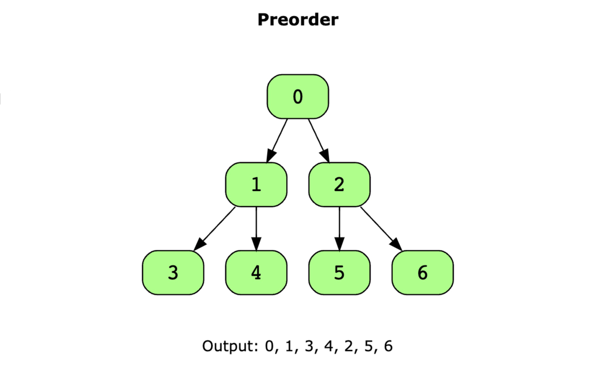
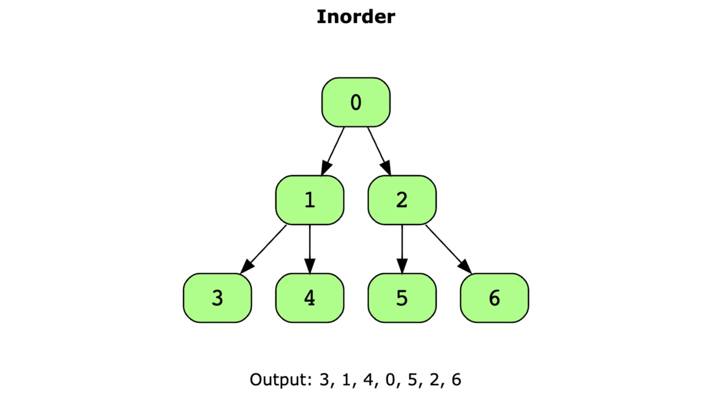
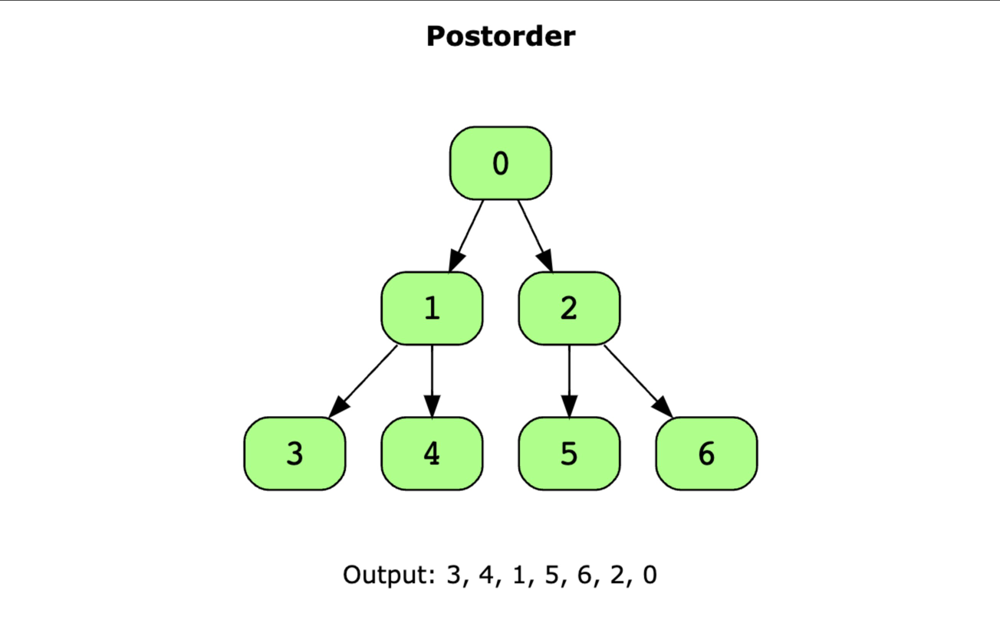

# 栈方式遍历二叉树

## 概要
#### ```遍历二叉树（Traversal of Binary Tree）```是一个常见的算法问题。遍历二叉树有四种常见顺序：```前序遍历```、```中序遍历```、```后序遍历```、```层序遍历```。```前序、中序、后序遍历```属于深度优先搜索（DFS, Depth-First Search），最简单的方式是通过递归实现。```层序遍历```属于广度优先搜索（BFS, Breadth-First Search），最简单的方式是通过队列实现。
#### 文章会先介绍前序、中序、后序遍历的概念，并给出递归的实现。剩下的大部分内容会围绕```非递归的实现```方式，对前序、中序、后序遍历展开思考，并逐步得到解决办法。

## 前序、中序、后序遍历二叉树的过程
### ```前序遍历（Preorder Traversal）```的概念，以及递归实现

#### 前序遍历的概念：首先访问当前节点，然后递归地遍历左子树，再递归地遍历右子树。简单来说就是按照```根->左->右```的顺序递归访问节点。

#### 图示-前序遍历


#### 前序遍历的算法步骤

1. 访问根节点
2. 递归地对左子节点执行前序遍历
3. 递归地对右子节点执行前序遍历

#### 前序遍历的递归实现

```TypeScript
// 文章后面的代码会省略TreeNode的定义
class TreeNode {
  val: number;
  left: TreeNode | null
  right: TreeNode | null
  constructor(val: number) {
    this.val = val
    this.left = null
    this.right = null
  }
}

function preOrder (root: TreeNode | null): void {
  if (root === null) return
  // 访问当前节点
  console.log(root.val)
  // 递归地对左子树进行前序遍历
  preOrder(root.left)
  // 递归地对右子树进行前序遍历
  preOrder(root.right)
}

```

### ```中序遍历（Inorder Traversal）```的概念，以及递归实现

#### 中序遍历的概念：首先递归地遍历左子树，然后访问当前节点（即子树的根节点），最后递归地遍历右子树。简单来说就是按照```左->根->右```的顺序递归访问节点。

#### 图示-中序遍历



#### 中序遍历的算法步骤
1. 递归地对左子节点执行前序遍历
2. 访问根节点
3. 递归地对右子节点执行前序遍历

#### 中序遍历的递归实现
```TypeScript
function inOrder(root: TreeNode | null): void {
  if (root === null) return;
  // 递归地对左子树进行中序遍历
  inOrder(root.left);
  // 访问当前节点
  console.log(root.val);
  // 递归地对右子树进行中序遍历
  inOrder(root.right);
}
```

### ```后序遍历（Postorder Traversal）```的概念，以及递归实现

#### 后序遍历的概念：首先递归地遍历左子树，然后递归地遍历右子树，最后访问当前节点（即子树的根节点）。简单来说就是按```左->右->根```的顺序递归访问节点。

#### 图示-后序遍历


#### 后序遍历的递归实现
```TypeScript
function postOrder(root: TreeNode | null): void {
  if (root === null) return;
  // 递归地对左子树进行后序遍历
  postOrder(root.left);
  // 递归地对右子树进行后序遍历
  postOrder(root.right);
  // 访问当前节点
  console.log(root.val);
}
```

## 前序、中序、后序的非递归遍历
### 如果不使用递归，该用什么方式实现遍历？
* 靠直觉想到的是通过```栈```。
* 尝试```分析一下用栈是否合理```：递归的本质是调用自身，底层实现是通过函数的调用栈。不能使用递归，那就用栈显式的控制数据。把节点用栈存储，通过控制入栈和出栈的过程，来实现三种顺序的遍历。所以用栈看起来没问题。
* 先序遍历看起来最简单，先尝试实现先序遍历，再实现另外两种。
### 非递归实现先序遍历
#### ```回顾```先序遍历的过程
可以先在头脑中构建一棵二叉树（或者手画），并按先序遍历的方式访问节点。走一次流程，会发现关键过程：对于一个节点，总是先访问自身，再访问左子节点，最后是右子节点。
#### 构造一个```计划```
* 先构想一个计划，再试图具体实现。
* 计划是这样：有一个```栈```用来存储节点，还有一个```while循环```控制遍历过程。每次循环都会让节点出栈或入栈，```节点```出```栈```就访问，整个```出栈```过程要保持```先序遍历```（即"先访问自身，再访问左子节点，最后是右子节点"）。
* 所以```关键点是如何入栈```（入栈顺序决定出栈顺序）。先随便试一下，用不同的方式入栈、出栈，也许就能找到办法了。
#### 尝试实现计划
##### 第一种```尝试```（不可行）
最直接的想法和递归的步骤类似：读取节点，然后入栈左子节点，再入栈右子节点。具体步骤如下：

1. 初始化：将根节点入栈
2. 进入循环，直到栈为空：
* 出栈一个节点，读取该节点。然后入栈该节点的左子节、再入栈右子节点。（如果相应子节点不存在，就不用入栈）
* 进入下一次循环

进行评估：先人肉运行一下，会发现右子节点会比左子节点先出栈，也就是右子节点先被访问。访问顺序是"根->右->左"，不符合"根->左->右"的顺序。这种做法不行。

##### 第二种```尝试```（可行）
思考一下第一种做法不行的原因：```入栈顺序有问题```。所以调整一下入栈顺序，进行新的尝试：读取节点，然后入栈右子节点，再入栈左子节点。具体步骤如下：

1. 初始化：将根节点入栈
2. 进入循环，直到栈为空：
* 出栈一个节点，读取该节点。然后入栈该节点的右子节，再入栈左子节点。（如果相应子节点不存在，就不用入栈）
* 进入下一次循环

```进行评估```：运行发现，出栈顺序符合"根->左->右"，这种方式符合先序遍历。时间复杂度在于循环，是O(n), 其中n为树的节点总数。空间复杂度在于栈，是O(h)，其中h为树的高度。这种方式可行。

#### 代码实现
```TypeScript
function preorderTraversal(root: TreeNode | null): number[] {
  // 判空
  if (!root) return []

  // 用数组记录遍历结果
  const result = []
  // 使用栈存储节点
  const stack: TreeNode[] = [root]

  // 栈不为空就一直循环（栈没空说明还有节点要处理）
  while (stack.length) {
    // 出栈
    const node = stack.pop()
    // 读取出栈节点
    result.push(node.val)
    // 右子节点先入栈（利用栈先进后出的特性，保证左子节点比右子节点先被访问。
    if (node.right) stack.push(node.right)
    // 左子节点入栈
    if (node.left) stack.push(node.left)
  }
  
  return result
}
```

### 非递归实现中序遍历
#### 思考过程
简单思考一下之后，没有找到太直观的思路。只好```回过头来```，看看现在我们拥有什么。从已有的东西出发，```构造一条达到目标的路径```。目前有两条重要```线索```：中序遍历的递归方式实现、前序遍历的栈方式实现。
##### ```重新观察```中序遍历的递归代码
```TypeScript
function inOrder(root: TreeNode | null): void {
  if (root === null) return;
  // 递归地对左子树进行中序遍历
  inOrder(root.left);
  // 访问当前节点
  console.log(root.val);
  // 递归地对右子树进行中序遍历
  inOrder(root.right);
}
```
通过分析代码的运行过程，会发现```关键```：程序在执行时，会递归地沿着左侧节点一直向下搜索，直到找到最左侧的节点，然后读取该节点的值。接着，程序会回溯到其父节点，并读取该父节点的值，最后再递归地处理右子树。

##### 通过```类比```得出思路，并构造计划
* 与思考前序遍历解法的方式类似：要是能把中序遍历的数据变动过程```用栈来表现```就好了。
* 于是得到一个大致的```计划```：一直尽量入栈左子节点。直到尽头后，出栈一个节点。读取该节点，再入栈该节点的右子节点。分析一下，结论是：节点出栈的顺序满足中序遍历，计划看起来```可行```。

#### 实现计划
需要一段代码去实现上述计划。对这段代码，我最直接的想法是：
* 需要有一个栈存储节点，将根节点入栈来初始化。```有一个循环体```来控制出入栈过程，循环的判断条件是栈是否为空。
* 在循环中，出栈一个节点。一直入栈节点的左子节点，```这样又需要一个循环```，而且这个循环被套在上述循环之内。
* 左子节点入栈的循环结束后，入栈右子节点。进入下一次外层循环。

这是一个从直觉出发、不经思考的想法。分析之后，发现存在一个```严重的问题```：何时读取节点，出栈就读取吗？这会导致节点先于其左子节点被访问。

分析```失败原因```：
* 这个实现方式不可行，是因为实现```偏离了计划```：计划原本是让左子节点一直入栈，再出栈，但在实现中却先出栈。
* 所以方案需要修改，但在此之前，```还需讨论一个问题```：将根节点入栈来初始化栈，这样做合适吗？：这样做可行但不合适。可行是因为：根节点入栈，是栈的变化过程的第一步。不是合适是因为：会导致循环体的代码不好写。

```修正```实现方案：
1. 定义```关键变量```
* 有一个存储节点的栈```stack```，初始值为空。
* 有一个节点类型的变量```current```，代表```内层循环入栈左节点过程中```的当前节点。```current```初始值是根节点```root```
2. 设计```循环过程```
* 有一个```外部循环体```。
* 还有一个```内部循环体```，用来一直入栈左节点。
* 内部循环完成后，```执行出栈```并读取出栈节点。
* 接下来```处理出栈节点的右子树```：把出栈节点的右子节点赋值给current。使进入下一次循环时，能对右子树进行处理。
* 进入下一次循环

分析这个方案，发现能保证```左->根->右```的节点访问顺序。```时间复杂度```是```O(n)```, 其中n为树的节点总数。```空间复杂度```是```O(h)```，其中```h```为树的高度。方案可行。

#### 代码实现
```TypeScript
function inorderTraversal (root: TreeNode | null): number[] {
  // 用数组记录中序遍历的结果
  const result: number[] = []
  // 使用栈存储节点，辅助迭代过程
  const stack: TreeNode[] = []
  // 因为需要迭代遍历的左节点，将其入栈。所以需要一个指针指向当前要处理的节点
  let current: TreeNode | null = root

  // 当stack不为空 或者 current不为空时，说明还没处理完，需要继续执行。
  while (stack.length || current) {
    // 入栈左子节点直到为空
    while (current) {
      stack.push(current)
      current = current.left
    }
    // 当左子树遍历完毕后，出栈节点并记录值，然后转向右子树
    const node = stack.pop()
    result.push(node.val)
    // current更新为右子节点，继续遍历其左子树
    current = node.right
  }

  return result
}
```

### 非递归实现后序遍历
#### 思考过程
和之前一样，```先观察```后序遍历的递归代码，尝试找出```关键特征```，并通过```模拟递归过程```来实现非递归版本。

```TypeScript
function postOrder(root: TreeNode | null): void {
  if (root === null) return;
  // 递归地对左子树进行后序遍历
  postOrder(root.left);
  // 递归地对右子树进行后序遍历
  postOrder(root.right);
  // 访问当前节点
  console.log(root.val);
}
```
通过分析代码的运行过程，会发现```关键特征```：先递归遍历左子树，再递归遍历右子树，最后访问当前节点。

可以得到一些```想法碎片：```
* ```父节点```要比```左子节点```先入栈。
* 如果```栈顶元素```的```右子节点```都已经被访问，则```出栈```并访问该元素，否则```入栈栈顶元素```的```左子节点```。
* 需要有个```状态```来记录```当前节点```的```右子节点```是否```入栈```过。设想一：这个状态是一个```HashSet```，记录所有入栈过右子节点的节点。设想二：是一个精准的```指针```，用该```指针```的指向，作为```状态判断```。

```完善想法：```
* 类似于```中序遍历```，我们需要一个```外部循环```来```迭代```整体流程，一个```内部循环```来依次将```左节点入栈```。
* ```状态判断```用```hashSet```看起来更简单，先用```hashSet```实现（后续再尝试优化成用```指针```实现）。
* ```外部循环体```的```执行```过程：
    1. 先执行```内部循环```，依次将```左节点入栈```
    2. 上一步结束后，接着处理```栈顶元素```：是该```弹出栈顶元素```，并访问；还是```入栈栈顶元素```的右子节点，并更新状态。这取决于```栈顶节点```的```右子节点```是否```入栈```过。
    3. 进入下一次循环

分析想法：```节点出栈顺序```是```左->右->根```，符合```后序遍历```的顺序。```时间复杂度```是```O(n)```，其中```n```为节点总数。空间复杂度需要考虑```栈```和```HashSet```，分别是```O(h)```和```O(n)```，综合起来是```O(n)```，其中```n```为节点总数，```h```为树的高度。```想法可行```。

#### 代码实现
##### 初始版本代码
按照上面的想法，先实现用```hashSet```记录状态的代码版本。
```TypeScript
// 通过栈后续遍历二叉树
function postorderTraversal (root: TreeNode | null): number[] {
  // 用数组记录后序遍历的结果
  const result: number[] = []
  // 使用栈存储节点，辅助迭代过程
  const stack: TreeNode[] = []
  // 收集右子节点已入栈的节点
  const rightChildPushedNodes: Set<TreeNode> = new Set()
  // 因为需要迭代遍历左节点，将其入栈。所以需要一个指针指向当前要处理的节点
  let current: TreeNode | null = root

  // 当stack不为空 或者 current不为空时，说明还没处理完，需要继续执行。
  while (stack.length || current) {
    // 内部循环，将左子节点入栈直至为空
    while (current) {
      stack.push(current) // 当前节点入栈
      current = current.left // 移动到左子节点
    }

    // 获取栈顶节点
    const node = stack[stack.length - 1]
    // 如果当前节点没有右子节点或者其右子节点已入栈，则将节点弹出并加入结果数组
    if (!node.right || rightChildPushedNodes.has(node)) {
      // 将节点值加入结果数组
      result.push(stack.pop().val)
    } else {
      // 否则，将右子节点入栈，并更新set
      // 移动到右子节点
      current = node.right
      // 该节点的右子节点下一次迭代会进行入栈处理，所以记录该节点的右子节点已被入栈
      rightChildPushedNodes.add(node)
    }
  }

  return result
}
```
##### 优化初始版本代码
##### 思路
用```hashSet```记录状态，会带来额外的```内存开销```，```空间复杂度```是O```(n)```。要是不用```hashSet```，只用一个```指针```就好了。

如果注意到一个```关键线索```："右子节点出栈后，下一个出栈的一定是其父节点"，就能找到办法。

只需判断一下，如果当前```栈顶元素```的```右子节点```就是上一次```出栈```的```节点```，说明```栈顶元素```的```右子节```点已经被处理过，所以直接出栈栈顶元素。

在每次```出栈```时，更新一个变量，保存```最近出栈的节点```。

##### 优化后的代码
使用```指针```代替```hashSet```保存状态。```空间复杂度```能优化到```O(h)```，其中```h```是树的高度。这个做法看```起来还不错```。

```TypeScript
function postorderTraversal (root: TreeNode | null): number[] {

  // 用数组存储后序遍历的结果
  const result: number[] = []
  // 使用栈存储节点，辅助迭代过程
  const stack: TreeNode[] = []
  // 因为需要迭代遍历的左节点，将其入栈。所以需要一个指针指向当前要处理的节点
  let current: TreeNode | null = root
  // 记录上一个被访问的节点
  let lastVisited: null | TreeNode = null

  // 当stack不为空 或者 current不为空时，说明还没处理完，需要继续执行。
  while (stack.length || current) {
    // 内部循环，将左子节点入栈直至为空
    while (current) {
      // 当前节点入栈
      stack.push(current)
      // 移动到左子节点
      current = current.left
    }

    // 获取栈顶节点
    current = stack[stack.length - 1]

    // 如果当前节点没有右子节点或者其右子节点已入栈，则将节点弹出并加入结果数组
    if (!current.right || lastVisited === current.right) {
      // 将节点值加入结果数组
      result.push(current.val)
      // 弹出栈顶节点
      stack.pop()
      // 更新上一个访问的节点为当前节点
      lastVisited = current
      // 将当前节点置为空，结束当前节点的处理
      current = null
    } else {
      // 否则，将右子节点入栈
      current = current.right
    }
  }

  return result
}
```

## 总结
* 解决一个算法问题，可以同时获得```侦探破案```和```下象棋```两种```乐趣```。
* ```思考```和```结果```之间总是存在`裂缝`，需要靠```实践```来```缝合```。```亲自动手```写代码才能得到`编程水平`的`提高`。

## 不足之处
* 缺乏```图示```支持。
* 主要在描述```思考过程```，算法步骤的描述```不够精细```，有些```细节```没说出来。

## 扩展思考
* ```二叉树```的```遍历```，使用```栈```和使用```递归```的实现，各自的```优缺点```在哪？
* 还有很多其他做法，比如栈实现后续遍历的另一种思路：对```栈```中```入栈``` ```null```，也能作为```状态标记```。
* 根据这两种方式的```特性```，它们的```运用场景```有什么```区别```？

